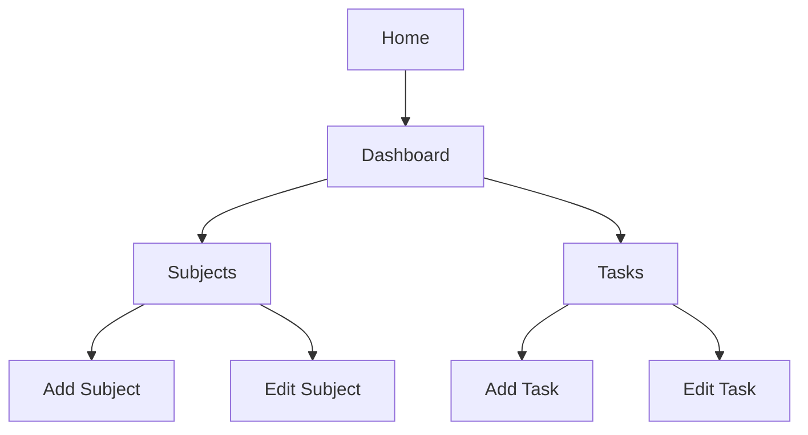
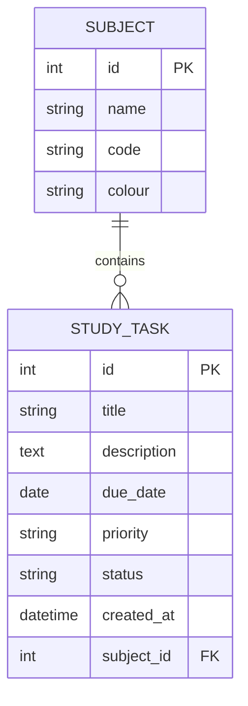

# StudyPlanController System Design

## 1. System Overview

StudyPlanController is a web application that helps university students manage subjects, study tasks, priorities and deadlines.

## 2. Page Structure

The application will contain the following pages:

| Page | Purpose |
|---|---|
| Home | Introduces the application |
| Dashboard | Displays task statistics and upcoming deadlines |
| Subjects | Displays and manages subjects |
| Add Subject | Allows the user to create a subject |
| Edit Subject | Allows the user to update a subject |
| Tasks | Displays and filters study tasks |
| Add Task | Allows the user to create a task |
| Edit Task | Allows the user to update a task |

## 3. Page Navigation

## 4. Dashboard Layout

The dashboard will contain:

| Section | Information |
|---|---|
| Navigation bar | Dashboard, Subjects and Tasks links |
| Summary cards | Total, completed, pending and overdue tasks |
| Upcoming deadlines | Tasks that are due soon |
| Recent tasks | Recently created study tasks |

## 5. Subject Page Layout

The subject page will contain:

- An Add Subject button
- A list of existing subjects
- Subject name and subject code
- An Edit button
- A Delete button

## 6. Task Page Layout

The task page will contain:

- An Add Task button
- Task title
- Related subject
- Due date
- Priority
- Completion status
- Edit and Delete buttons
- Subject, priority and status filters

## 7. Database Design

The system will use two main database tables:

### Subject Table

| Field | Type | Description |
|---|---|---|
| id | Integer | Primary key |
| name | String | Subject name |
| code | String | Subject code |
| colour | String | Display colour |

### StudyTask Table

| Field | Type | Description |
|---|---|---|
| id | Integer | Primary key |
| title | String | Task title |
| description | Text | Task details |
| due_date | Date | Task deadline |
| priority | String | Low, Medium or High |
| status | String | Pending or Completed |
| created_at | DateTime | Task creation time |
| subject_id | Integer | Foreign key linked to Subject |

## 8. Entity Relationship

## 9. Relationship Explanation

One subject can contain multiple study tasks. Each study task belongs to one subject. The `subject_id` field connects the StudyTask table to the Subject table.